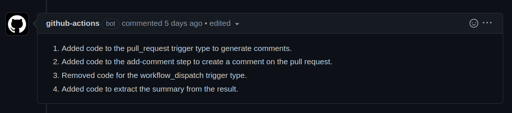

# Lab: Changelog Generator

A POC for a pipeline that generates a changelog for a given PR - using code diffs and OpenAI's API - and adds it to the PR as a comment.



## Configuration

The secret `OPENAI_API_KEY` must be defined in Github in order for the application to authenticate with OpenAI's API.

## How it works?

A python script [generate_docs.py](https://github.com/rpopuc/lab-pr-changelog-generator/blob/0acff565a14502db0a46697cf5a328219f429801/.github/workflows/generate_docs.py) gets the diffs from the current PR and the main branch, classifies these diffs in 'added', 'modified' and 'deleted' blocks, and then requests a description from OpenAI's API based on these blocks:

```
Based only on this diffs:
Added code:
{added_code}

Deleted code:
{deleted_code}

Modified code:
{modified_code}.

Explain the main changes made to the code in terms of added, changed, or removed features, with one change per line.
```
